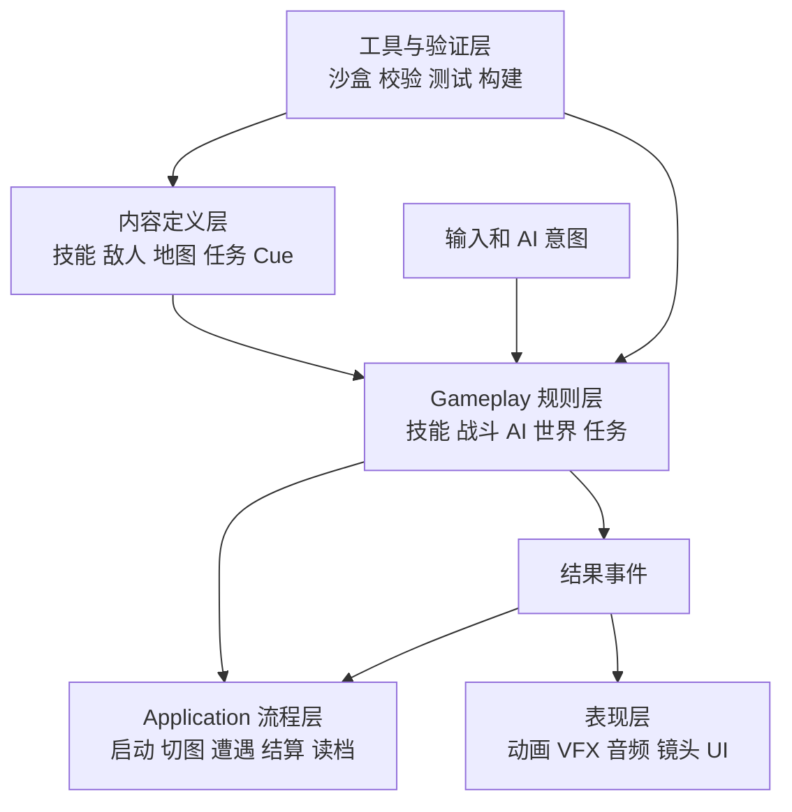

# 总体架构与设计原则

状态：提案  
适用范围：完整游戏运行时、内容制作和后续 DLC

2026-10-02 路线确认：主游戏采用《宝可梦 火红／叶绿》式二维俯视多地图结构，战斗为即时制。HD2D 三维演武场保留为技术样板，不作为正式主世界和关卡模板。Gameplay、任务、地图图结构和内容定义原则不变。

## 1. 游戏定位对架构的影响

本项目是固定操作吕布的 2D 实时战斗冒险游戏，主要内容由以下循环组成：

```text
城镇或营地准备
→ 前往野外和地标探索
→ 遭遇人形小兵或 Boss
→ 获得技能、成长或剧情进展
→ 回到安全区域调整技能与资源
→ 解锁新路线并重访旧区域
```

因此架构的主轴不是队伍收集、随机刷装或多人同步，而是：

- 操作反馈明确的实时战斗。
- 可持续扩展的技能、Buff 和 Boss 机制。
- 地图连接、重访、入口解锁和少量快速旅行。
- 技能收集、有限携带与可控强化。
- 单机任务、剧情、存档和内容更新。

首期不因为“以后可能联机”而引入网络回滚、帧同步和权威服务器结构。运行时对象需要身份清晰、规则入口统一，但不为未确认的多人需求支付当前复杂度。

## 2. 从参考游戏中借鉴什么

### 2.1 Dota 2：技能与状态组合

借鉴内容：

- 技能定义、施法实例和单位状态分离。
- Ability 负责施法过程，Modifier 负责持续状态和规则修正。
- 基础效果积木能够组合出大量技能。
- 特殊技能允许脚本扩展，而不是强迫所有技能进入通用配置。
- 技能、粒子、声音和 UI 是不同的内容领域。

不直接照搬：

- 多人权威服务器和网络复制。
- 英雄百人规模的通用性成本。
- 对局型经济、物品和地图规则。

### 2.2 Warcraft III：对象、地图与触发器分离

借鉴内容：

- Object：单位、技能、物品等稳定数据。
- Terrain：地图几何、区域和摆放内容。
- Trigger：事件、条件、动作和剧情流程。
- Sound/Asset：表现资源独立管理。

在本项目中分别映射为：

| Warcraft III 思路 | 本项目对应结构 |
| --- | --- |
| Object Editor | `ContentRegistry` 与 `.tres` Definition |
| Trigger Editor | 任务条件、地图触发器、剧情事件 |
| Terrain Editor | Godot 地图场景与 TileMapLayer |
| Sound Editor | Audio Cue、Audio Bus 与资源配置 |
| AI Editor | AI 行为配置、决策器与 Boss 阶段 |
| Asset Manager | Source、导入预设和内容校验器 |

### 2.3 《宝可梦 火红/叶绿》：地图连接与重访

借鉴内容：

- 世界由多张小地图组成，而不是一个巨型场景。
- 出入口关系清晰，玩家能形成空间记忆。
- 通过能力、剧情或机关解锁旧区域的新路径。
- 城镇承担补给、剧情和传送节点职责。
- 路线、城镇、洞窟和建筑内部形成不同节奏。

不照搬回合制战斗、随机草丛遇敌和队伍收集。

当前进一步确定：地图制作与系统主体也采用该类二维俯视 TileMap 结构；玩家仍固定操作吕布，敌人以地图内可见人形单位为主，接触后进行地图内或独立二维房间的即时战斗。

### 2.4 《魔女之泉》：据点与外出循环

借鉴内容：

- 安全据点中进行训练、配置和剧情推进。
- 外出探索有明确目的和阶段收益。
- 成长行为需要限制收益，避免无限重复成为最优解。
- 角色成长与剧情节点相互反馈。

## 3. 五层架构



### 3.1 Core/Domain

保存不依赖具体场景的规则和数据结构，例如：

- 稳定 ID 和命名空间。
- 战斗时间、单位动作时间、实际时间。
- 伤害请求和结算结果。
- 技能、Buff 和任务的运行时状态。
- 确定性随机数入口。
- 通用 Result、错误码和只读快照。

纯规则优先使用普通 C# 类型，以便不启动完整场景也能测试。

### 3.2 Gameplay

实现技能、战斗、AI、遭遇、地图、任务、成长和物品等游戏规则。Gameplay 可以调用 Core，但不能直接依赖某个 UI 节点或具体粒子文件。

### 3.3 Application

负责把多个 Gameplay 模块串成玩家流程：

- 新游戏和读档。
- 切换地图和入口定位。
- 开始、结束和重置遭遇。
- 打开营地、商店和技能配置。
- 章节推进和返回主菜单。

Application 负责用例编排，不负责具体伤害和技能公式。

### 3.4 Presentation

消费规则层产出的结果，播放：

- 动画。
- 刀光、光环、粒子和 Shader。
- 音效、环境音和音乐。
- 镜头震动、缩放和慢镜头。
- HUD、飘字、提示和菜单反馈。

表现层可以因为画质设置或性能策略丢弃部分装饰效果，但不能改变规则结果。

### 3.5 Content/Tools

Content 保存正式运行时定义；Tools 帮助制作者安全地产生和检查这些内容。小团队最先需要的不是大型可视化编辑器，而是：

- Inspector 可编辑的自定义 Resource。
- 内容注册和稳定 ID。
- 自动校验器。
- 技能与战斗沙盒。
- 地图连接检查。
- Headless 冒烟测试。

## 4. 依赖方向

必须遵守以下方向：

```text
Presentation → 读取 Gameplay 结果
Application  → 编排 Gameplay 用例
Gameplay     → 使用 Core
Content      → 被 Gameplay 读取
Tools        → 检查 Content 和 Gameplay
```

禁止出现：

- `DamageResolver` 直接查找 HUD 节点并显示数字。
- Skill Definition 保存当前剩余冷却。
- 地图触发器直接修改具体 UI 控件。
- VFX 播放结束回调决定技能是否真正命中。
- 存档层序列化 Godot Node。
- 核心规则按地图文件名、中文技能名或 DLC 名称写大量分支。

## 5. 三种主要数据形态

### 5.1 Definition：只读内容定义

适合 Godot 自定义 `Resource` 和 `.tres`：

- SkillDefinition
- ModifierDefinition
- UnitDefinition
- ItemDefinition
- MapDefinition
- EncounterDefinition
- QuestDefinition
- GameplayCueDefinition

同一路径的 Resource 可能被缓存并共享引用，因此 Definition 在运行中按项目约定视为只读，不能存单位私有状态。

### 5.2 Runtime：每个实体独立状态

例如：

- UnitRuntime
- SkillRuntime
- ModifierInstance
- QuestRuntime
- MapRuntimeState
- EncounterRuntime

Runtime 记录生命、冷却、层数、进度、已触发节点等可变状态。

### 5.3 Snapshot/DTO：跨边界数据

用于伤害快照、存档、调试和事件：

- 不保存 Node 引用。
- 不保存 Delegate、Signal 连接或 Task。
- 使用稳定 ID 关联内容。
- 带版本号，允许迁移。

## 6. 事件使用原则

事件不是所有调用的替代品。

- 命令和查询优先使用明确方法，例如 `TryCast`、`ResolveDamage`、`CanEnterMap`。
- 同一遭遇内部使用局部、强类型的战斗事件流。
- 跨模块的重要事实使用语义事件，例如 `UnitDefeated`、`EncounterCleared`、`MapEntered`。
- 全局事件总线只处理少量真正跨场景的事件，不能变成隐式依赖中心。
- 伤害派生、反伤和击杀爆炸进入队列处理，不在回调栈中无限递归。

## 7. 当前实现与目标结构的关系

当前 `Scripts/Combat`、`Scripts/Characters`、`Scripts/AI` 和 `Scripts/UI` 已经形成第一场对战的原型基础。迁移原则是：

1. 先保持现有对战可玩和测试可运行。
2. 从确实重复的普攻、横扫、突进中抽取技能内核。
3. 不一次性重写全部角色代码。
4. 每抽取一个模块，保留或补充对应冒烟测试。
5. 世界、任务和 DLC 结构不能反向拖慢当前 S1/S2 的战斗验证。
