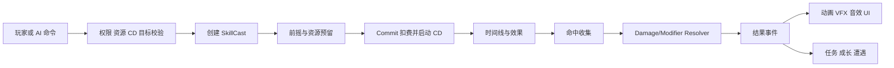

# 技能、状态与战斗架构

状态：提案；核心原则继承自现有[战斗与扩展架构](../Demand/Stage/附录-战斗与扩展架构.md)。  
目标：让玩家、Boss 和小兵共享规则，并能用配置组合大多数技能。

## 1. 核心对象与所有权

| 对象 | 形态 | 保存内容 | 生命周期 |
| --- | --- | --- | --- |
| SkillDefinition | 自定义 Resource | ID、目标规则、消耗、CD、时间线、效果参数 | 全局只读 |
| SkillRuntime | 普通 C# 状态 | 等级、强化选择、剩余 CD、充能 | 每个单位每个技能一份 |
| SkillCast | 普通 C# 状态 | CastId、方向快照、目标、阶段、命中集合、取消原因 | 每次施法一份 |
| EffectDefinition | Resource 或序列化数据 | 伤害、位移、Buff、区域等效果配置 | 全局只读 |
| EffectInstance | Node 或普通状态 | 投射物、区域、陷阱的实时位置与寿命 | 每个效果一份 |
| ModifierDefinition | 自定义 Resource | 持续、叠加、驱散、权限、数值修正、触发器 | 全局只读 |
| ModifierInstance | 普通 C# 状态 | 来源、目标、层数、剩余时间、Tick 游标 | 每次有效挂载一份 |
| DamageRequest | 只读 DTO | 来源快照、分量、方向、标签、控制意图 | 单次伤害请求 |
| DamageResult | 只读 DTO | 实际伤害、吸收、暴击、免疫、死亡、控制结果 | 单次结算结果 |

严禁在 SkillDefinition 或 ModifierDefinition 中保存：

- 当前冷却。
- 当前层数。
- 当前目标 Node。
- 本次命中过的单位。
- 释放者引用。
- 运行中的计时器和异步任务。

## 2. 技能组成模型

一个技能由五组可组合内容构成：

### 2.1 Cast Policy：施法策略

- 是否允许移动施法。
- 是否允许转向。
- 是否可被闪避取消。
- 提交前和提交后分别如何处理取消。
- 资源在什么时点预留和扣除。
- 冷却在什么时点开始。
- 是否需要目标仍然有效。

### 2.2 Targeting：目标规则

首期目标规则建议支持：

- Self：自身。
- Unit：指定单位。
- Point：指定位置。
- Direction：指定方向。
- Circle：圆形范围。
- Sector：扇形范围。
- Rectangle：矩形或直线范围。
- AutoNearest：自动选择最近合法单位。

目标选择应独立于效果执行。一个技能可以先选择方向，再由多个 Effect 分别查询沿途目标。

### 2.3 Timeline：时间线

统一阶段：

```text
Validate
→ Windup 前摇
→ Commit 提交
→ Active 有效或持续阶段
→ Recovery 后摇
→ Complete
```

时间线节点按顺序执行，每个节点最多一次。同一物理帧跨过多个节点时，仍按定义顺序处理，不能依赖浮点时间刚好相等。

### 2.4 Effect：效果积木

首批通用效果：

| Effect | 作用 |
| --- | --- |
| DealDamage | 生成 DamageRequest |
| Heal | 生成独立 HealRequest |
| ApplyModifier | 施加 Buff 或 Debuff |
| RemoveModifier | 按 ID、标签或驱散类型移除状态 |
| MoveCaster | 突进、后跳、冲刺 |
| Knockback | 推开目标 |
| Pull | 将目标拉向指定点 |
| SpawnProjectile | 创建飞行物 |
| SpawnArea | 创建持续区域、火场、旗阵或光环 |
| Teleport | 合法位置间瞬移 |
| Summon | 生成独立单位或临时对象 |
| ChangeResource | 增减怒气、法力等资源 |
| PlayGameplayCue | 发出表现提示，不负责规则结算 |

### 2.5 Custom Handler：特殊机制扩展

不适合通用积木的技能使用专用 Handler，例如：

```text
core:effect/steal_last_skill
core:effect/copy_boss_form
core:effect/repeat_cast_randomly
```

Handler 必须通过受控接口读取上下文和提交效果，不能绕过 CombatResolver 直接修改敌人生命。这样可以支持类似拉比克、变身、多重施法等机制，同时避免把配置系统扩张为难以调试的脚本语言。

## 3. 施法流程



默认资源与冷却规则：

| 时点 | 资源 | 冷却 |
| --- | --- | --- |
| 校验失败 | 不变化 | 不变化 |
| 前摇开始 | 预留 | 不开始 |
| 提交前取消或死亡 | 释放预留 | 不开完整 CD；可有短取消恢复期 |
| Commit | 一次性扣除 | 从提交时刻开始 |
| Commit 后被打断 | 默认不退款 | 正常继续 |

持续消耗技能以后采用每 Tick 事务支付；资源不足时结束。不能允许资源变成负数后继续维持。

## 4. 取消和清理合同

终止原因至少包含：

```text
Completed
PlayerCanceled
Interrupted
OwnerDied
SceneChanged
InvalidTarget
```

所有技能清理必须：

- 可重复调用且结果一致。
- 关闭本次 CastId 拥有的 Hitbox。
- 释放尚未提交的资源预留。
- 解除本次施法施加的动作限制。
- 清理订阅和临时对象。
- 停止贴身、蓄力和引导特效。
- 不误关后来施法创建的判定或效果。

已发射的独立投射物是否随施法者死亡消失，由 Effect Definition 明确决定。场景切换默认销毁旧地图的投射物、区域和遭遇状态。

## 5. 命中收集

碰撞重叠不等于已经造成伤害。Hitbox 只负责发现候选目标，规则层还要检查：

- 目标是否存活。
- 阵营是否合法。
- 是否处于正确受击层。
- 是否已经被本 HitGroup 命中过。
- 是否满足距离、方向和目标标签。
- 伤害来源是否仍然有效或已有来源快照。

去重键建议：

```text
(CastId, HitGroupId, TargetUnitId)
```

持续区域使用：

```text
(EffectId, TickIndex, TargetUnitId)
```

快速突进和飞行物不能只检查终点重叠，需要检查从上一位置到当前位置的路径。多个 Hurtbox 必须归一到同一个 `UnitId`。

## 6. 伤害模型

### 6.1 DamageRequest

建议字段：

- RequestId、RootEventId、CastId、HitGroupId。
- SourceUnitId、TargetUnitId、SkillId。
- SourceTags：BasicAttack、Skill、Dot、Reflected、Environment 等。
- SourceSnapshot：攻击、技能等级、出伤倍率、暴击参数。
- DamageComponents：物理、术法等分量。
- AttackOrigin、AttackDirection、IncomingDirection。
- DefenderFacingAtContact。
- ControlPayload：击退、硬直或控制意图。
- TriggerDepth、RemainingProcBudget。

### 6.2 DamageResult

建议字段：

- 每种伤害的结算前后数值。
- 防御和方向减伤。
- 护盾吸收。
- 实际扣血。
- 是否暴击、免疫、格挡。
- 是否死亡。
- 成功施加的控制和 Modifier。

表现层只能根据 DamageResult 播放“暴击”“免疫”或伤害数字，不能看到请求就假定成功。

### 6.3 首期结算顺序

1. 校验目标、阵营和重复请求。
2. 读取来源快照，完成一次伤害包的暴击决策。
3. 分伤害类型应用防御、方向和免疫规则。
4. 处理护盾并统一取整。
5. 原子提交生命变化并判定死亡。
6. 生成 DamageResult。
7. 按结果施加控制和 Buff。
8. 将反伤、吸血和击杀触发加入后置队列。

伤害公式首版可以保持简单：

```text
基础分量 × 出伤倍率 × 方向倍率 × 100 / (100 + 对应防御)
```

仅在玩法确实需要时增加更多伤害类型和穿透字段。

## 7. Modifier 与权限聚合

基础行动状态建议为：

```text
Idle / Move / Attack / Cast / Dodge / Hurt / Dead
```

眩晕、沉默、定身等不是新的主状态，而是 Modifier 提供的权限约束：

```text
CanMove
CanAttack
CanCast
CanDodge
CanUseItem
```

最终权限由所有有效来源聚合。一个眩晕结束时重新聚合，不能直接写 `CanMove = true`，否则会覆盖仍生效的定身。

Modifier 需要明确：

- 唯一 ID 和标签。
- 正面、负面或中性。
- 可否驱散及驱散等级。
- 最大层数。
- 刷新持续、增加层数、独立计时或替换强者。
- 周期 Tick。
- 属性修正。
- 权限限制。
- 触发事件。
- 来源死亡后的处理策略。

## 8. 触发链和递归限制

可能形成循环的机制包括：

- 双方反伤。
- 吸血触发治疗再触发其他效果。
- 击杀爆炸造成下一次击杀。
- 多重施法继续触发多重施法。
- Modifier 在 OnDamage 中同步制造新的 Damage。

规则：

- 后置效果进入事件队列，不在回调栈中递归执行。
- 保留 RootEventId。
- 限制最大触发深度，例如 4 层。
- 限制单个根事件的后置请求数，例如 32 个。
- 每个触发器声明“每次命中、每次施法或每个根事件最多一次”。
- 超限时记录开发日志并停止新增派生事件。

## 9. 技能强化

强化优先改变 Definition 参数和组合，不直接修改 SkillRunner：

- 数值：范围、伤害、持续、冷却、消耗。
- 形态：直线变扇形、单次变多段、区域变大。
- 附加效果：命中燃烧、结束击飞、击杀刷新部分 CD。
- 策略：可移动施法、获得一次充能、提交后不可中断。

强化结果应由以下结构计算得到：

```text
基础 SkillDefinition
+ SkillLevel
+ UpgradeChoice
+ Unit Attribute
→ 本次施法只读 SkillSnapshot
```

不能在运行中直接执行 `Definition.Damage += 10`。

## 10. 示例：龙卷风

```text
SkillId: core:skill/tornado
Targeting: Direction
Windup: 0.35s
Commit:
  - 扣除资源
  - 开始 CD
  - SpawnArea(core:area/tornado_line)
Area:
  - 沿方向移动
  - 每 0.15s 查询范围目标
  - DealDamage(术法)
  - Pull(朝区域中心)
  - GameplayCue(core:cue/tornado_hit)
Expire:
  - GameplayCue(core:cue/tornado_end)
```

可选强化：

- 范围更宽。
- 移动变慢、持续更久。
- 结束时击飞。
- 对同一目标的首次命中施加短暂减速。

这些强化都应复用现有效果积木。

## 11. 示例：Boss 拉近攻击

```text
第一段：Pull
  - 明确预警
  - 将玩家拉到 Boss 前方安全点
  - 默认不造成伤害
第二段：Delay 0.3–1.0s
  - 玩家可以移动或闪避逃脱
第三段：Sector Attack
  - 使用新的 HitGroupId
  - 命中后造成伤害和击退
```

拉近和后续攻击可以属于同一 SkillCast，也可以由 Boss 行为序列连接两个技能。首期若没有复用需求，保持一个专用技能时间线更简单。

## 12. 技能系统验收标准

新增一个只使用既有机制的技能时：

- 不修改 `Combatant`。
- 不修改 `DamageResolver`。
- 不修改 `SkillRunner`。
- 不修改 HUD 核心代码。
- 只新增 Definition、可选的 Effect 场景、Cue 和角色装备配置。

新增特殊机制时：

- 最多新增一个明确的 Effect/Trigger Handler。
- Handler 通过统一结算入口提交结果。
- 有至少一个规则测试和一个场景冒烟测试。

